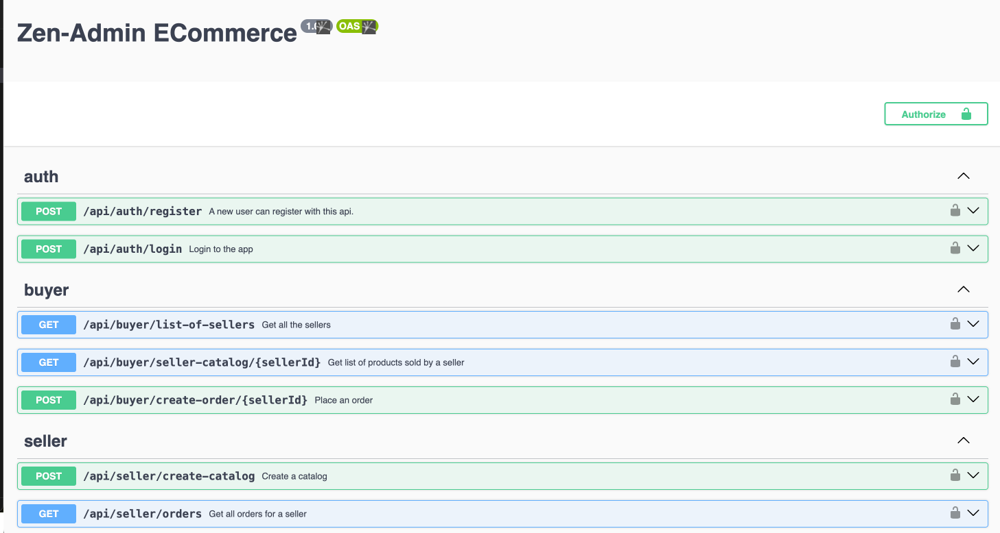

**How to Run**

- Clone the repo `git clone https://github.com/ankitaabad/zenadmin.git`
- Requires recent node version >= 18.16.0
- Install the dependencies `npm install`
- Run the Server `npm run dev`

**How to Test**

- Go to `http://localhost:3000/api-docs` to open the swagger ui.
- Run the apis.
- Apis other than auth requires a token, use the login api to get the token and pass it in authorization field as `Bearer ${token}`

---

**Test Cases**

- Run the server `npm run dev`
- Run the api test cases `npm run test`

**Folder Structrue**

- `src/apis/buyer` folder contains the apis contracts and handler for buyer apis. similarly we have `src/apis/auth` and `src/apis/seller`
- `test/*` contains the api test cases.
- `prisma` folder contains the database schema and migrations
- `src/zapatos` folder contains auto generated database types for query building.
- `fake` folder contains auto generated fake creators from prisma.

**Tech Stack**

- `Prisma` is used to maintain a declarative database schema.
- `Zapatos` is used to write typesafe queries.
- `ts-rest` is used to create typesafe apis and generate Swagger UI.
